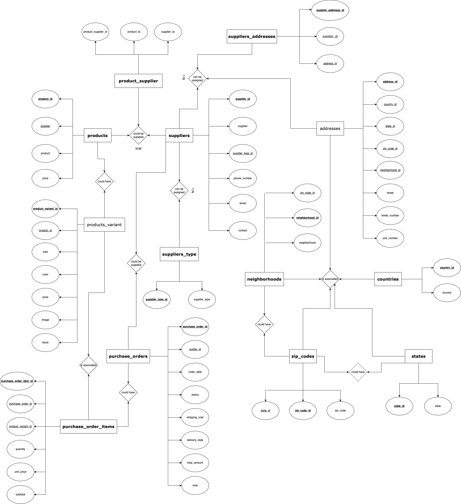
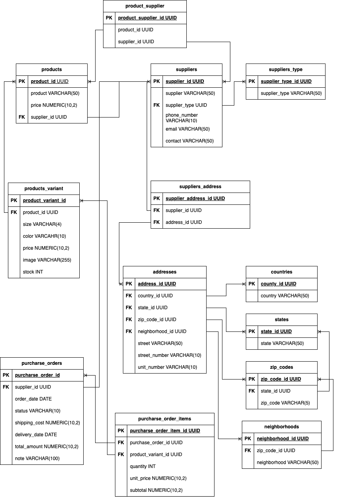

# Mimda store inventory

## List of entities

### products **ED**

- product_id **(PK)**
- product
- price
- supplier_id **(FK)**

### products_variant **ED**

- product_variant_id **(PK)**
- product_id **(FK)**
- size
- color
- prize
- image
- stock

### suppliers **ED**

- supplier_id **(PK)**
- supplier
- supplier_type_id **(FK)**
- phone_number
- email
- contact

### suppliers_type **EC**

- supplier_type_id **(PK)**
- supplier_type

### products_suppliers **EP**

- product_supplier_id **(PK)**
- product_id **(FK)**
- supplier_id **(FK)**

### addresses **ED**

- address_id **(PK)**
- country_id **(FK)**
- state_id **(FK)**
- zip_code_id **(FK)**
- neighborhood_id **(FK)**
- street
- street_number
- unit_number

### supplier_addresses **EP**

- supplier_address_id **(PK)**
- supplier_id **(FK)**
- address_id **(FK)**

### countries **EC**

- county_id **(PK)**
- country

### states **EC**

- state_id **(PK)**
- state

### zip_codes **EC**

- zip_code_id **(PK)**
- state_id **(FK)**
- zip_code

### neighborhoods **EC**

- neighborhood_id **(PK)**
- zip_code_id **(FK)**
- neighborhood

### purchase_orders **ED**

- purchase_order_id **(PK)**
- supplier_id **(FK)**
- order_date
- status
- shipping_cost
- delivery_date
- total_amount
- note

### purchase_order_itmes **ED**

- purchase_order_item_id **(PK)**
- purchase_order_id **(FK)**
- product_variant_id **(FK)**
- quantity
- unit_price
- subtotal

## Relations

### products _to_ supliers

- A **product** _could be supplied_ by different **supplier** (_1 to Many_).
- A **supplier** _supplies_ diferents **products** (_1 to many_).
- Relation _1:N_

### products _to_ products_variant

- A **product** _could have_ many **variants** (_1 to many_).
- A **variant** _is about_ a **product** (_1 to 1_).
- Relation _1:N_

### suppliers to supplier_types

- A **supplier** _can be assigned_ a **supplier type** (_1 to 1_).
- A **supplier type** _could be assigned_ to different **suppliers** (_1 to many_).
- Relation _1:N_

### suppliers to suppliers_address

- A **supplier** _could have_ diferent **addresses** (_1 to many_).
- An **address** _can be just assigned_ to a **supplier** (_1 to 1_).
- Relation _1:N_

### suppliers_address to countries

- An **address** _can be assigned_ a **country** (_1 to 1_).
- A **country** _could be assigned_ to different **addressess** (_1 to many_).
- Relation _1:N_

### suppliers_address to states

- An **address** _is associated to_ a **state** (_1 to 1_).
- A **state** _could have_ different **addressess** (_1 to many_).
- Relation _1:N_

### suppliers_address to zip_codes

- An **address** _is associated to_ a **zip_code** (_1 to 1_).
- A **zip_code** _could have_ different **addressess** (_1 to many_).
- Relation _1:N_

### suppliers_address to neighborhoods

- An **address** _is associated to_ a **neighborhood** (_1 to 1_).
- A **neighborhood** _could have_ different **addressess** (_1 to many_).
- Relation _1:N_

### states to zip_codes

- A **state** _could have_ many **zip_codes** (_1 to many_).
- A **zip_code** _is associated to_ a **state** (_1 to 1_).
- Relation _1:N_

### zip_codes to neighborhoods

- A **zip_code** _could have_ many **neighborhoods** (_1 to many_).
- A **neighborhood** _is associated to_ a **zip_code** (_1 to 1_).
- Relation _1:N_

### purchase_orders to suppliers
- A **purchase order** _could be_ supplied by a **supplier** (_1 to 1_).
- A **suplier** _could suplied_ different **orders** (_1 to many_).
- Relation _1:N_

### purchase_order_items to purchase_orders
- A **purchase order** _could have_ many **items** (_1 to many_).
- An **item** _is related_ to a  **purchase_order_item** (_1 to 1_).
- Relation _1:N_

### purchase_order_items to products_variant
- A **purchase order item** _is associated_ to only one **product variant** (_1 to 1_).
- An **product variant** _could be associated_ to many **purchase_order_item** (_1 to many_).
- Relation _1:N_

## Diagrams

### Modelo Entidad - Relacion

### Modelo Relacional

## Glossary

- **PK**: _Primary Key_
- **FK**: _Foreign Key_
- **ED**: Entidad de Datos
- **EP**: Entidad Pivote
- **EC**: Entidad Catalogo